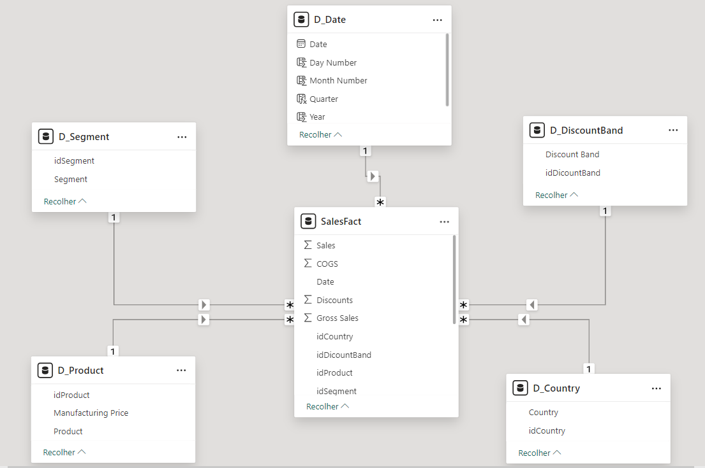

# Projeto Modelo Dimensional -  Star Schema :star:

## NTT DATA - Engenharia de Dados com Python

  

Descrição.

  

### Projeto do Módulo 4 de Power BI - Modelagem Dimensional no PowerBI.

Criação de diagrama dimensional Star Schema com base em uma tabela única Financial Sample.

**Estrutura do Star Schema**

**Dimensões**

1.  **D_Product**

-   **ID**: Chave Primária que identifica exclusivamente cada produto.
-   **Product**: Nome do produto, permitindo análises por tipo de produto.
-   **Manufacturing Price**: Preço de fabricação, usado para calcular margens e custos.

_Comentário_: Esta tabela de dimensão armazena informações detalhadas sobre os produtos, permitindo análises aprofundadas das vendas por item.

2.  **D_Country**

-   **ID**: Chave Primária que identifica exclusivamente cada país.
-   **Country**: Nome do país, facilitando a análise geográfica das vendas.

_Comentário_: A tabela de países permite segmentar as vendas por local, ajudando a entender tendências e padrões regionais.

3.  **D_Segment**

-   **ID**: Chave Primária que identifica exclusivamente cada segmento de mercado.
-   **Segment**: Nome do segmento, possibilitando a análise das vendas por categorias de clientes.

_Comentário_: Esta dimensão ajuda a classificar os dados de vendas de acordo com diferentes segmentos de mercado, permitindo uma compreensão mais profunda das necessidades dos clientes.

4.  **D_DiscountBand**

-   **ID**: Chave Primária que identifica exclusivamente cada faixa de desconto.
-   **Discount Band**: Nome da faixa de desconto, utilizado para análises de preços e promoções.

_Comentário_: A tabela de faixas de desconto é crucial para entender como as promoções afetam as vendas e a lucratividade.

5.  **D_Date**

-   **ID**: Chave Primária que identifica exclusivamente cada data.
-   **Date**: Data real, utilizada para a análise temporal.
-   **Day Number**: Número do dia, útil para análises diárias.
-   **Month Number**: Número do mês, facilitando análises mensais.
-   **Quarter**: Trimestre do ano, permitindo análises trimestrais.
-   **Year**: Ano, essencial para relatórios anuais.
-   **Year-Month**: Combinação de ano e mês, utilizada para facilitar a visualização de tendências mensais.

_Comentário_: A tabela de datas é fundamental para realizar análises ao longo do tempo, permitindo comparar vendas em diferentes períodos e identificar tendências.

**Fato**

-   **Fact_Sales**

-   **ID**: Chave Primária que identifica cada registro de venda.
-   **IDCountry**: Chave Estrangeira que se refere à tabela D_Country.
-   **IDProduct**: Chave Estrangeira que se refere à tabela D_Product.
-   **IDSegment**: Chave Estrangeira que se refere à tabela D_Segment.
-   **IDDiscountBand**: Chave Estrangeira que se refere à tabela D_DiscountBand.
-   **Sales**: Total de vendas, utilizado para calcular receita.
-   **COGS**: Custo das Mercadorias Vendidas, essencial para calcular margens de lucro.
-   **Date**: Chave Estrangeira que se refere à tabela D_Date.
-   **Discount**: Valor do desconto aplicado na venda.
-   **Gross Sales**: Vendas brutas antes de descontos.
-   **Profit**: Lucro obtido na venda, importante para análises de rentabilidade.
-   **Sales Price**: Preço de venda, que pode variar por transação.
-   **Units Sold**: Total de unidades vendidas.

_Comentário_: A tabela de fatos armazena os dados transacionais de vendas, permitindo análises detalhadas de desempenho financeiro e operacional. As chaves estrangeiras conectam os dados de vendas às dimensões, possibilitando relatórios integrados.

**Medidas DAX**
-   **Average Sales Price**: Calcula o preço médio de venda para todas as transações, considerando variações por unidade vendida.
-   **Profit Margin**: Calcula a margem de lucro percentual sobre o total de vendas.
-   **Total COGS**: Soma total do custo das mercadorias vendidas, essencial para análise de lucratividade.
-   **Total Profit**: Calcula o lucro total, considerando receitas e custos.
-   **Total Sales**: Soma total das vendas realizadas em todas as transações.